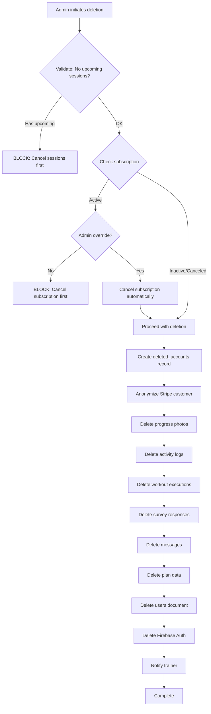

# Account Deletion Implementation Specification

## Overview

This document specifies the complete architecture and implementation for account deletion functionality in the Shreyas Fitness Platform. Account deletion must comply with legal requirements (GDPR, CCPA) while preserving necessary financial records and maintaining data integrity.

## Requirements & Constraints

### Legal Requirements

**Data Subject Rights (GDPR/CCPA):**
- Users have the right to delete their personal data
- Response time: 30 days (GDPR), 45 days (CCPA)
- Exceptions: Financial records must be retained

**Financial Record Retention:**
- Payment history: 7 years (typical accounting requirement)
- Tax documentation: IRS requires 3-7 years
- Fraud prevention: Indefinite retention of transaction records

### Business Requirements

**Pre-Deletion Validations:**
1. No upcoming training sessions (must cancel first)
2. Active subscription must be handled:
   - If active: Cancel subscription first (or admin override)
   - If already canceled: Allow deletion

**Data Preservation:**
- Stripe customer ID linkage for financial queries
- Payment transaction records
- Session attendance logs (anonymized)
- Audit trail of deletion

## Architecture

### Firestore Collections

#### New Collection: `deleted_accounts`

Minimal record to maintain financial audit trail:

```javascript
deleted_accounts/{originalUserId} = {
  // Identity (anonymized)
  deletedUserId: "original-firebase-uid",
  anonymizedEmail: "deleted-user-{randomId}@privacy.local",
  originalEmailHash: "sha256-hash-of-original-email", // For lookups if needed
  
  // Financial linkage
  stripeCustomerId: "cus_xxx",
  
  // Deletion metadata
  deletedAt: timestamp,
  deletedBy: "admin|self-service",
  deletedByAdminId: "admin-uid" (if admin-deleted),
  reason: "user-requested|admin-action|...",
  
  // Retained for legal purposes
  accountCreatedAt: timestamp,
  lastPaymentDate: timestamp (if any),
  totalPayments: number,
  
  // Audit trail
  hadActiveSubscription: boolean,
  hadUpcomingSessions: boolean,
  sessionsCompleted: number
}
```

### Modified Collections

#### `users/{uid}` - DELETED
All PII removed, entire document deleted.

#### `stripe_customers/{uid}` - PRESERVED
Maintained by Stripe Extension for payment history.
- Payment records stay intact
- Subscription history preserved
- Customer metadata anonymized in Stripe

### Firebase Storage

**Progress Photos** (`progress-photos/{userId}/`):
- All photos deleted
- Storage path removed

### Stripe

**Customer Record - ANONYMIZED (not deleted):**
```javascript
// Before deletion:
{
  id: "cus_xxx",
  name: "John Doe",
  email: "john@example.com",
  phone: "+1234567890",
  metadata: { userId: "firebase-uid" }
}

// After deletion:
{
  id: "cus_xxx",  // Preserved for payment history
  name: "Deleted User",
  email: "deleted-{randomId}@privacy.local",
  phone: null,
  description: "Account deleted on 2025-12-27",
  metadata: { 
    userId: "deleted",
    deletedAt: "2025-12-27T10:00:00Z",
    originalUserIdHash: "sha256-hash"
  }
}
```

## Deletion Flow

### Step-by-Step Process



### Validation Rules

**BLOCK deletion if:**
1. User has upcoming sessions (status: 'scheduled')
   - Error: "Cannot delete account with upcoming sessions. Cancel all sessions first."
   
**WARN but allow with override if:**
2. Active subscription exists
   - Default: "Account has active subscription. Cancel subscription first."
   - Admin override: Auto-cancel subscription, then proceed

**Always allow if:**
3. No subscription (session-only client)
4. Canceled subscription (already at period end)
5. Past-due subscription

## Implementation Details

### Cloud Function: `deleteAccount`

**Function Signature:**
```javascript
exports.deleteAccount = onCall({
  region: sharedConfig.region,
  secrets: [stripeKey],
  cors: true,
}, async (request) => {
  // Implementation
});
```

**Input Parameters:**
```javascript
{
  targetUserId: string,           // User to delete
  adminOverride: boolean,          // Allow deletion despite active subscription
  reason: string                   // Deletion reason
}
```

**Authentication:**
- Requires admin role
- Logs admin who performed deletion
- Validates admin has permission

**Response:**
```javascript
{
  success: boolean,
  message: string,
  deletedUserId: string,
  stripeCustomerId: string,
  itemsDeleted: {
    photos: number,
    activities: number,
    workouts: number,
    surveys: number,
    messages: number
  }
}
```

### Deletion Order (Critical)

**Why order matters:** Prevent orphaned data and ensure financial records preserved.

```javascript
// 1. VALIDATE (fail fast)
await validateNoUpcomingSessions(userId);
await validateSubscriptionStatus(userId, adminOverride);

// 2. CREATE AUDIT RECORD (before any deletion)
const deletionRecord = await createDeletedAccountRecord(userId, userData);

// 3. ANONYMIZE STRIPE (preserve payment history)
await anonymizeStripeCustomer(stripeCustomerId);

// 4. DELETE USER CONTENT (cascading, bottom-up)
await deleteProgressPhotos(userId);
await deleteActivityLogs(userId);
await deleteWorkoutExecutions(userId);
await deleteSurveyResponses(userId);
await deleteMessages(userId);
await deletePlanData(userId);

// 5. UPDATE TRAINER (remove from client list)
await removeClientFromTrainer(userId, trainerId);

// 6. DELETE FIRESTORE USER DOC
await admin.firestore().collection('users').doc(userId).delete();

// 7. DELETE FIREBASE AUTH (final, point of no return)
await admin.auth().deleteUser(userId);

// 8. LOG COMPLETION
logger.info('Account deleted successfully', { userId, deletedBy });
```

### Error Handling & Rollback

**Transactional Approach:**
- Steps 1-2: Validation and audit (no rollback needed)
- Steps 3-6: Partial deletion possible - log and continue
- Step 7: Final step - only execute if all previous steps succeed

**On Failure:**
```javascript
try {
  // Deletion steps
} catch (error) {
  // Log detailed error
  logger.error('Account deletion failed', {
    userId,
    failedStep: currentStep,
    error: error.message,
    partialDeletionState
  });
  
  // Don't rollback - may leave partial state
  // Admin must review and retry or manual cleanup
  
  return {
    success: false,
    error: error.message,
    partialDeletion: true,
    completedSteps: completedSteps
  };
}
```

## Admin UI Implementation

### Location: Client Management Page

**Add "Delete Account" button:**
- Location: Individual client detail page
- Requires admin role
- Red/destructive styling
- Disabled if validation fails

### Confirmation Dialog Flow

**Step 1: Initial Warning**
```
⚠️ Delete Client Account

You are about to PERMANENTLY delete:
- Name: John Doe
- Email: john@example.com
- Member since: Jan 15, 2024

This action:
✓ Deletes all personal data
✓ Removes progress photos, workouts, surveys
✓ Preserves payment history (legal requirement)
✓ Cannot be undone

[Cancel] [Continue]
```

**Step 2: Validation Check**
```javascript
// Check for blockers
const upcoming = await checkUpcomingSessions(userId);
const subscription = await checkSubscriptionStatus(userId);

if (upcoming.length > 0) {
  // Show error modal
  "Cannot delete: Client has {count} upcoming sessions.
   Cancel all sessions first."
}

if (subscription.active) {
  // Show warning with override option
  "⚠️ Active Subscription Detected
   
   Client has active subscription.
   
   Options:
   ○ Cancel subscription, then delete
   ○ Override and auto-cancel subscription
   
   [Go Back] [Auto-Cancel & Delete]"
}
```

**Step 3: Final Confirmation**
```
🚨 Final Confirmation

Type the client's email to confirm deletion:
[___________________________________]

Reason for deletion (required):
[___________________________________]

☐ I understand this is permanent and cannot be undone

[Cancel] [Delete Account Permanently]
```

### Success/Error Handling

**Success:**
```
✓ Account Deleted Successfully

John Doe's account has been permanently deleted.
- Firestore data: Deleted
- Firebase Auth: Deleted  
- Stripe customer: Anonymized
- Progress photos: Deleted
- Financial records: Preserved

The client has been removed from your client list.

[Close]
```

**Error:**
```
✗ Deletion Failed

Failed to delete account: {error message}

Partial deletion may have occurred. 
Please contact support with error code: {errorId}

[Contact Support] [Close]
```

## Testing Scenarios

### Test Case 1: Clean Session-Only Client
```
Given: Client with no subscription, no sessions
When: Admin deletes account
Then: Complete deletion succeeds
```

### Test Case 2: Client with Upcoming Sessions
```
Given: Client with scheduled session tomorrow
When: Admin attempts deletion
Then: Deletion blocked with error message
```

### Test Case 3: Active Subscription
```
Given: Client with active monthly subscription
When: Admin deletes without override
Then: Deletion blocked, option to cancel first
When: Admin deletes with override
Then: Subscription auto-canceled, deletion proceeds
```

### Test Case 4: Canceled Subscription
```
Given: Client with canceled subscription (still in access period)
When: Admin deletes account
Then: Deletion proceeds without warning
```

### Test Case 5: Past Sessions Only
```
Given: Client with completed sessions, no upcoming
When: Admin deletes account
Then: 
  - Deletion succeeds
  - Session logs preserved in anonymized form
  - Payment records intact in Stripe
```

### Test Case 6: Large Data Volume
```
Given: Client with 500+ progress photos, 1000+ activities
When: Admin deletes account
Then:
  - Batch deletion completes successfully
  - No timeout errors
  - All storage cleaned up
```

## Future: Client Self-Service

### UI Location
`/dashboard/client/membership` → Danger Zone section

### Additional Validations for Self-Service
1. Email verification required
2. Password re-confirmation
3. Reason selection (optional feedback)
4. Export data option (GDPR compliance)

### Self-Service Flow
```
1. User clicks "Delete My Account"
2. Email confirmation sent
3. User clicks link in email
4. Re-enter password
5. Same validation checks as admin flow
6. If has upcoming sessions: Error, must cancel first
7. If has active subscription: Must cancel first (no override)
8. Final confirmation screen
9. Deletion proceeds
10. Logout immediately
```

## Data Export (GDPR Compliance)

### Export Endpoint: `exportUserData`

**What to export:**
```javascript
{
  profile: { name, email, phone, created, ... },
  subscription: { status, history, ... },
  sessions: [ { date, location, notes, ... } ],
  workouts: [ { date, exercises, performance, ... } ],
  nutrition: { plans, logs, ... },
  activity: [ { date, steps, water, weight, ... } ],
  progress: { photos: [urls], measurements, ... },
  surveys: [ { date, responses, ... } ]
}
```

**Format:** JSON file
**Delivery:** Download link or email
**Timing:** Before deletion, user must export first

## Security Considerations

### Authorization
- Only admins can delete accounts
- Log all deletion attempts (success and failure)
- Require re-authentication for sensitive operations

### Audit Trail
```javascript
// Log to separate audit collection
audit_logs/{timestamp} = {
  action: 'account_deletion',
  targetUserId: userId,
  performedBy: adminId,
  performedAt: timestamp,
  reason: reason,
  success: boolean,
  details: {...}
}
```

### Rate Limiting
- Max 5 deletions per admin per hour
- Prevents accidental mass deletion
- Alert on unusual patterns

## Compliance Checklist

- [x] GDPR right to erasure (Art. 17)
- [x] CCPA right to deletion
- [x] Financial record retention (7 years)
- [x] Audit trail for compliance reporting
- [x] Data export capability
- [x] Anonymization vs deletion strategy
- [x] Third-party data handling (Stripe)

## Rollout Plan

### Phase 1: Admin-Only (Launch)
- Implement Cloud Function
- Add admin UI
- Test thoroughly
- Document manual process

### Phase 2: Self-Service (Month 3-4)
- Add client UI
- Implement data export
- Email confirmation flow
- Enhanced validation

### Phase 3: Automation (Month 6+)
- Scheduled cleanup of abandoned accounts
- Automated reminders before deletion
- Bulk deletion tools for admins

## Notes

- Stripe payment history preserved indefinitely (legal requirement)
- Consider soft-delete flag for 30-day grace period (future enhancement)
- Monitor deletion patterns for business insights
- Regular compliance audits recommended
